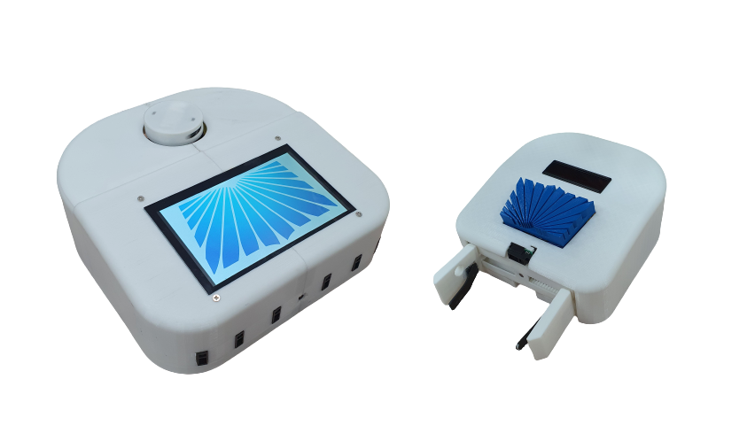
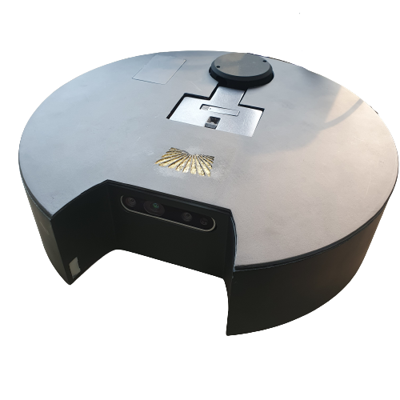
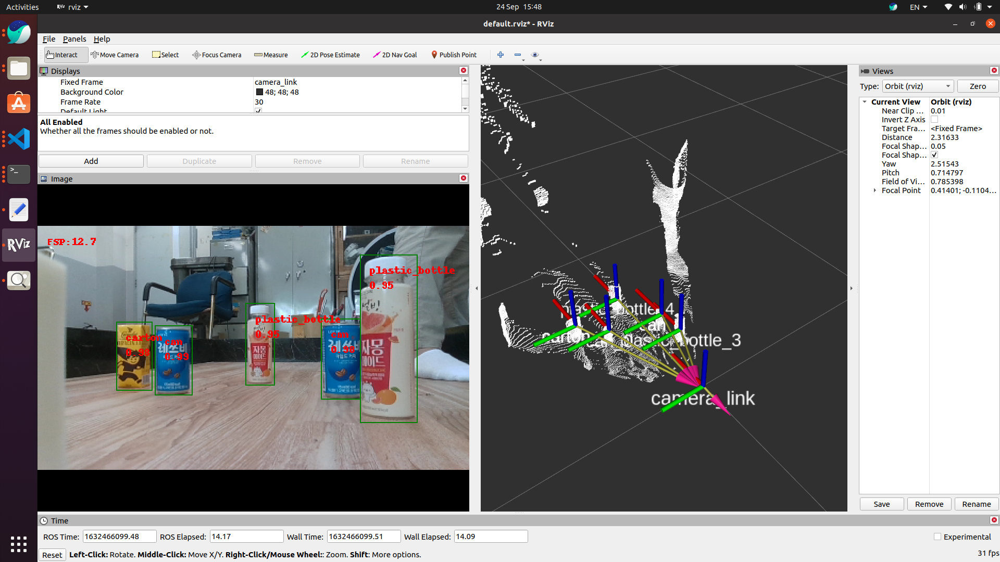
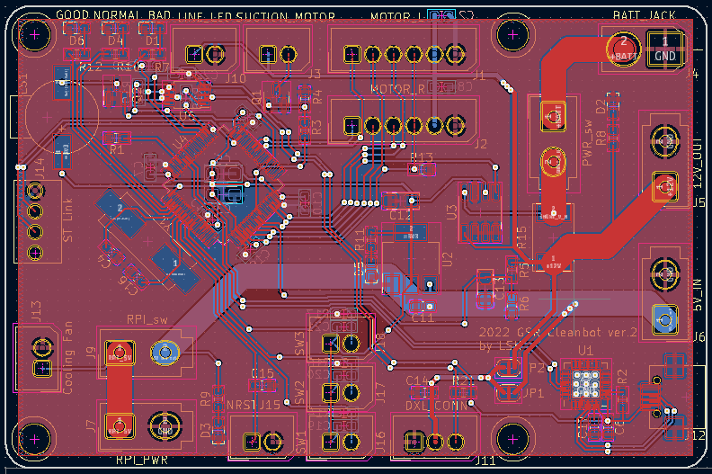

# Portfolio

## Profile

- 동양미래대학교 반도체전자공학과 졸업(2년제)
- 동양미래대학교 정보전자공학과 재학(학사과정)

## Skills

- C/C++/python
  - C/C++
    - AVR/STM32 마이크로컨트롤러 펌웨어 개발
    - ROS를 이용한 로봇 제어
  - python
    - opencv와 딥러닝 기법을 이용한 물체인식/분류 프로젝트 개발
    - ROS를 이용한 로봇 제어
- ROS
  - SLAM 및 Navigation 스택을 이용해 간단한 FSM을 구성하여 경로를 계획하고 물체를 운반하는 프로젝트 개발
- OrCad/Pads/kicad
  - MCU와 UART, I2C, SPI 통신을 이용한 peripheral과 아날로그 센서 등으로 구성된 단층 PCB 회로를 제작하여 프로젝트를 진행한 경험이 있음

## Projects

### 인공지능 쓰레기 분류 청소&분리수거 로봇 ver.1(2020)

- 대학교 동아리에서 처음으로 진행한 프로젝트입니다.

- github: https://github.com/seonghoYi/20_vacuum_cleaner_robot

- 펌웨어 개발 (ATMEGA128)

  스탭모터 제어(구동용)

  SBC(Jetson nano)와 통신 프로토콜 구현(I2C)

- python 제어 프로그램 개발 (Jetson nano)

  keras를 이용한 이미지 분류(Classification) 신경망 적용

  움직임 제어 및 분리수거 로봇과 협동 동작 구현

### 인공지능 쓰레기 분류 청소&분리수거 로봇 ver.2(2021)

- 대학교 동아리에서 진행한 작품을 조금 더 개선한 프로젝트입니다.
  
- github
  
  - https://github.com/seonghoYi/ATMEGA_fw
  - https://github.com/seonghoYi/vacuum_cleaner_ros
  
- 펌웨어 개발 (ATMEGA128)

  incremental encoder 모터 PID 제어

  PWM 기반 서보모터 제어

  SBC(Raspberry pi 4와 통신 프로토콜 구현(UART)

- ROS 기반 제어 프로그램 개발 (Raspberry pi 4)

  SLAM 알고리즘 패키지를 이용한 매핑

  Navigation 스택을 활용한 FSM 기반 경로계획 구현

- 3D Depth 카메라를 이용한 물체인식

  
  
  - 영상: https://www.youtube.com/watch?v=SG92WyChURY
  
    딥러닝 물체인식 신경망을 딥러닝 가속기(Google Coral)에 적용하여 임베디드(Non-GPU)환경에서 실시간 물체인식 시스템을 구현하였음
  
    3D Depth 카메라(Intel Realsense)를 응용하여 3차원 공간상에서의 특정 물체를 인식/추적하는 시스템을 구현하였음

#### 인공지능 쓰레기 분류 청소&분리수거 로봇 ver.3(2022)

- 대학교 동아리에서 기초개발까지만 참여한 마지막 프로젝트이며 21년도 작품의 마이너 업그레이드입니다.

- github

  https://github.com/seonghoYi/cleanbot_2022_fw

  https://github.com/seonghoYi/cleanbot_2022_hw

  https://github.com/seonghoYi/cleanbot_2022_ros

- 펌웨어 개발 (stm32f103)

  incremental encoder 모터 PID 제어

  rosserial 포팅

- ROS 기반 제어 프로그램 개발 (raspberry pi 4)

  3D Depth 카메라를 이용한 물체인식

  RTABMAP을 이용한 3D SLAM 및 Navigation

  - https://www.youtube.com/watch?v=QXOtTIL9o_U

- 하드웨어 개발

  

  - stm32f103rct를 이용하여 로봇의 제어보드를 개발

